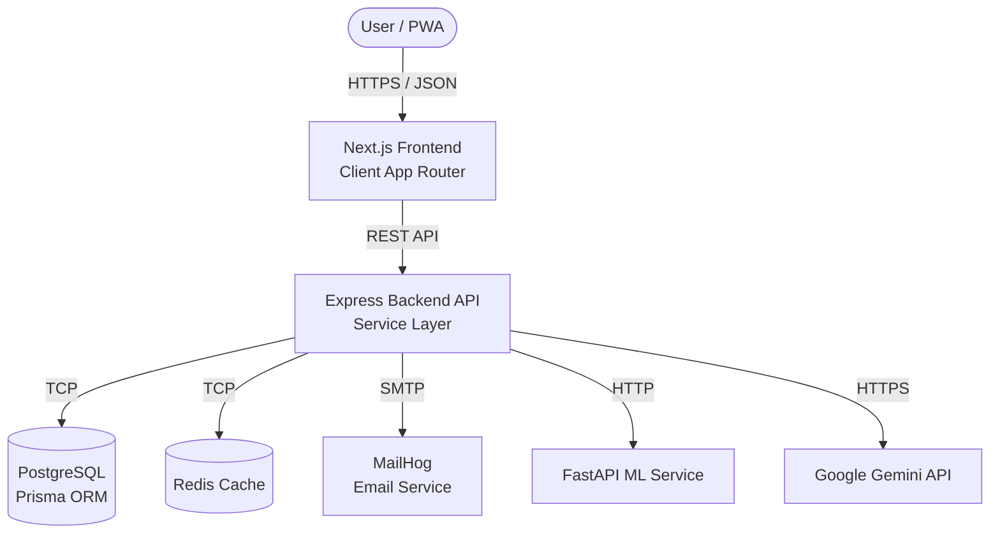

# 🏛️ CarbonIQ AI — Architecture & Engineering Standards

This document outlines the architectural decisions, design patterns, and engineering standards implemented in the CarbonIQ AI platform.

## System Context Diagram

## 1. Architectural Patterns

### Backend (Express.js)
The backend enforces a strict **Controller-Service-Repository Pattern** to maintain Single Responsibility Principle (SRP) and Separation of Concerns.

*   **Controllers (`src/controllers/`)**: Handle HTTP request extraction, validation routing, and HTTP response formatting. No business logic.
*   **Services (`src/services/`)**: Contain all core business logic. They process data and orchestrate database calls or external API calls.
*   **Data Access Layer (`prisma/`)**: Prisma acts as our strongly-typed ORM.

### Dependency Injection (DI) Pattern
We utilize dependency injection interfaces for external services to allow easy swapping of providers (e.g., from Mailhog to AWS SES, or from Mock AI to Gemini).

*   `EmailService` Interface -> Implemented by `MailhogService`.
*   `AiService` Interface -> Implemented by `GeminiService`.
    *   *Resilience Strategy*: If the `GEMINI_API_KEY` is missing, the service automatically falls back to deterministic mock responses without crashing the application.

## 2. Security Implementations (OWASP Top 10)

*   **Authentication**: JWT-based with short-lived access tokens (15m) and HTTP-only refresh token rotation logic. Passwords hashed via `bcryptjs`.
*   **Data Validation**: All incoming requests (params, query, body) and Environment Variables are strongly validated against `zod` schemas.
*   **Headers & Protection**: `helmet` for secure HTTP headers, standard CORS configuration, and planned Rate Limiting.
*   **Logging**: `pino-http` for structured, non-blocking JSON logging (stripping sensitive data like passwords/tokens).

## 3. Frontend Architecture

### Next.js 15 App Router
*   Utilizes the App Router (`/app`) for seamless server/client component boundaries.
*   **State Management**: `zustand` is used for global state (Authentication, Themes).
*   **API Interception**: Axios instance is configured with request/response interceptors to automatically inject JWT tokens and handle seamless refresh-token rotation on 401 Unauthorized responses.
*   **PWA**: `next-pwa` integration ensures the application can be installed on mobile devices and utilizes service workers for caching.

### Design System (Shadcn + Tailwind)
*   **Glassmorphism**: Heavy use of semi-transparent backgrounds with backdrop-blur.
*   **Theming**: `next-themes` manages dark/light mode via CSS variables injected at the `:root` level.
*   **Animations**: `framer-motion` handles page transitions, staggering list views, and micro-interactions.

## 4. Machine Learning Pipeline (Python/FastAPI)

The ML service is an isolated microservice, allowing it to scale independently of the Node.js backend.

*   **Algorithm**: `GradientBoostingRegressor` from `scikit-learn` used for predictive modeling of carbon emissions based on multi-variate lifestyle inputs.
*   **Pipeline**: The API exposes a `/train` endpoint which triggers the data generation, feature engineering, cross-validation, and model persistence (saving via `joblib`).

## 5. Deployment Strategy (Docker)

All services are containerized. Dockerfiles utilize **Multi-Stage Builds** to minimize image size and attack surface.

*   **Node.js Services**: Use `node:20-alpine`, building in one stage and copying only `dist/`, `package.json`, and `node_modules` (production only) to the final stage. Runs as a non-root user.
*   **Next.js**: Utilizes `output: 'standalone'` configuration to bundle a minimal server.
*   **Python ML Service**: Uses `python:3.11-slim`, separating dependency installation (`pip install --prefix=/install`) from the final runtime container.
