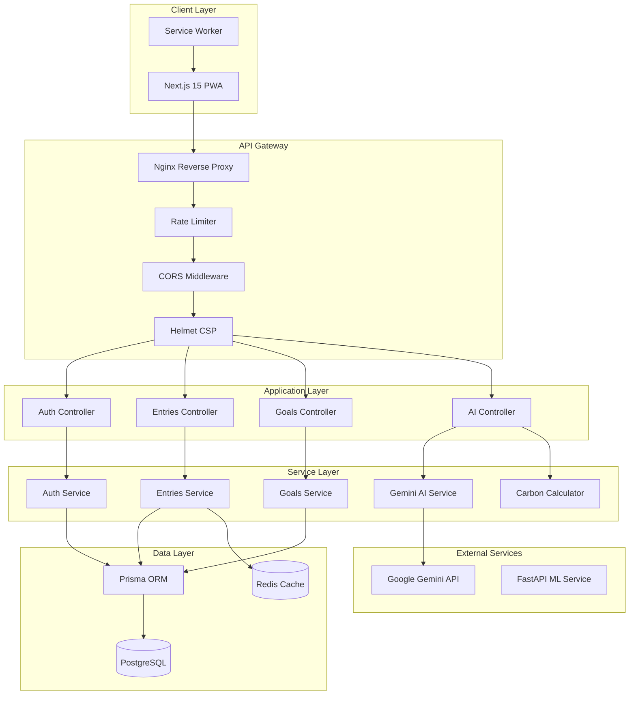
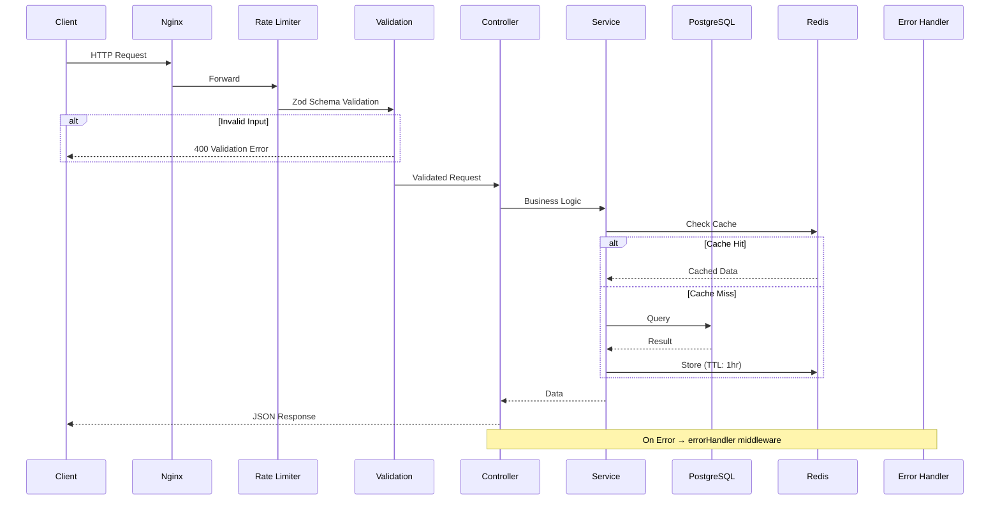
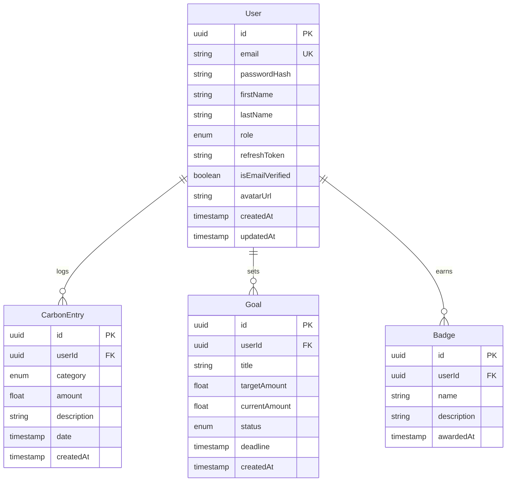
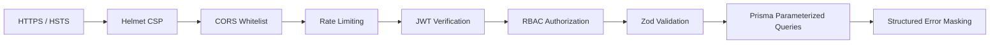
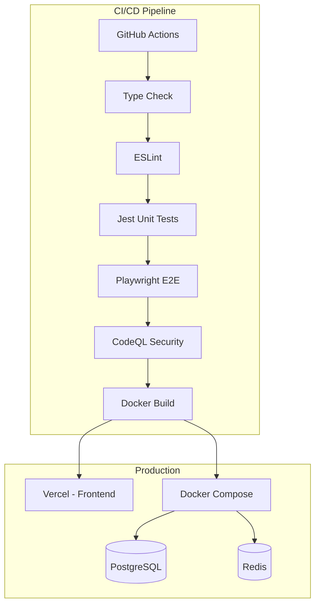

# CarbonIQ AI — Architecture Documentation

## System Architecture

```mermaid
graph TB
    subgraph "Client Layer"
        PWA[Next.js 15 PWA]
        SW[Service Worker]
    end

    subgraph "API Gateway"
        Nginx[Nginx Reverse Proxy]
        RL[Rate Limiter]
        CORS[CORS Middleware]
        Helmet[Helmet CSP]
    end

    subgraph "Application Layer"
        Auth[Auth Controller]
        Entries[Entries Controller]
        Goals[Goals Controller]
        AI[AI Controller]
    end

    subgraph "Service Layer"
        AuthSvc[Auth Service]
        EntrySvc[Entries Service]
        GoalSvc[Goals Service]
        GeminiSvc[Gemini AI Service]
        CalcSvc[Carbon Calculator]
    end

    subgraph "Data Layer"
        Prisma[Prisma ORM]
        PG[(PostgreSQL)]
        Redis[(Redis Cache)]
    end

    subgraph "External Services"
        Gemini[Google Gemini API]
        ML[FastAPI ML Service]
    end

    PWA --> Nginx
    SW --> PWA
    Nginx --> RL --> CORS --> Helmet
    Helmet --> Auth & Entries & Goals & AI
    Auth --> AuthSvc --> Prisma --> PG
    Entries --> EntrySvc --> Prisma
    Goals --> GoalSvc --> Prisma
    AI --> GeminiSvc --> Gemini
    AI --> CalcSvc
    EntrySvc --> Redis
```

## Request Lifecycle

```mermaid
sequenceDiagram
    participant C as Client
    participant N as Nginx
    participant RL as Rate Limiter
    participant V as Validation
    participant Ctrl as Controller
    participant Svc as Service
    participant DB as PostgreSQL
    participant Cache as Redis
    participant EH as Error Handler

    C->>N: HTTP Request
    N->>RL: Forward
    RL->>V: Zod Schema Validation
    alt Invalid Input
        V-->>C: 400 Validation Error
    end
    V->>Ctrl: Validated Request
    Ctrl->>Svc: Business Logic
    Svc->>Cache: Check Cache
    alt Cache Hit
        Cache-->>Svc: Cached Data
    else Cache Miss
        Svc->>DB: Query
        DB-->>Svc: Result
        Svc->>Cache: Store (TTL: 1hr)
    end
    Svc-->>Ctrl: Data
    Ctrl-->>C: JSON Response
    Note over Ctrl,EH: On Error → errorHandler middleware
```

## Data Model

```mermaid
erDiagram
    User ||--o{ CarbonEntry : logs
    User ||--o{ Goal : sets
    User ||--o{ Badge : earns

    User {
        uuid id PK
        string email UK
        string passwordHash
        string firstName
        string lastName
        enum role
        string refreshToken
        boolean isEmailVerified
        string avatarUrl
        timestamp createdAt
        timestamp updatedAt
    }

    CarbonEntry {
        uuid id PK
        uuid userId FK
        enum category
        float amount
        string description
        timestamp date
        timestamp createdAt
    }

    Goal {
        uuid id PK
        uuid userId FK
        string title
        float targetAmount
        float currentAmount
        enum status
        timestamp deadline
        timestamp createdAt
    }

    Badge {
        uuid id PK
        uuid userId FK
        string name
        string description
        timestamp awardedAt
    }
```

## Security Layers

```mermaid
graph LR
    A[HTTPS / HSTS] --> B[Helmet CSP]
    B --> C[CORS Whitelist]
    C --> D[Rate Limiting]
    D --> E[JWT Verification]
    E --> F[RBAC Authorization]
    F --> G[Zod Validation]
    G --> H[Prisma Parameterized Queries]
    H --> I[Structured Error Masking]
```

## Deployment Architecture

```mermaid
graph TD
    subgraph "CI/CD Pipeline"
        GH[GitHub Actions]
        TC[Type Check]
        LI[ESLint]
        UT[Jest Unit Tests]
        E2E[Playwright E2E]
        CQL[CodeQL Security]
        BD[Docker Build]
    end

    subgraph "Production"
        Vercel[Vercel - Frontend]
        Docker[Docker Compose]
        PG[(PostgreSQL)]
        Redis[(Redis)]
    end

    GH --> TC --> LI --> UT --> E2E --> CQL --> BD
    BD --> Vercel & Docker
    Docker --> PG & Redis
```
